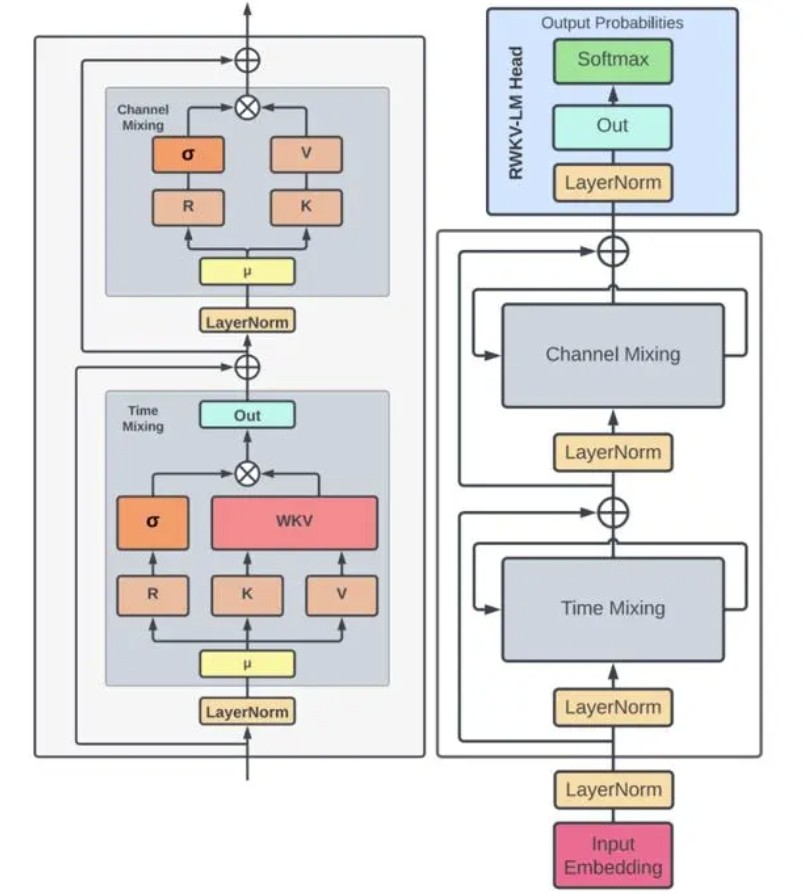
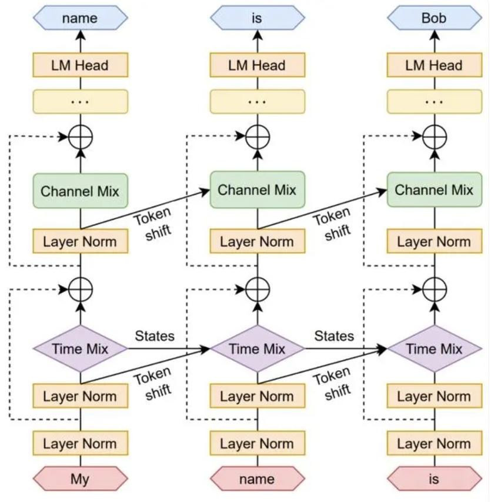

<div align="center">

# MAI3-Lab:Web3Game Collaborative PlatformPowered By AI
</div>


Dedicated to providing comprehensive support services for Web3 game developers using cutting-edge artificial intelligence technology and toolsets.
By using the MAI3 collaboration tool, we can improve the efficiency and creativity of game development, reduce R&D costs including labor and technology costs, and achieve seamless integration from game concept to actual deployment. Efficiently create your own game project!,

# Todo List

- [ ] Train and publish the MAI3-GPT model
- [ ] Publish content to generate intelligent agents
- [ ] Publish contracts and code intelligent rest
- [ ] Publish sound effects to generate intelligent agents
- [ ] Publish image generation agent
- [ ] Release game intelligent NPC intelligent agents

# About MAI3-GPT
MAI3 GPT is a fine-tuning model based on RWKV for WEB3GAME. It is an RNN with GPT-level LLM performance, which can also be directly trained like a GPT transformer (parallelizable).

<div align="center">
  
</div>

The architecture consists of a series of stacked residual blocks, each of which is composed of time mixed and channel mixed sub blocks with a cyclic structure.

The loop is represented as a linear interpolation between the current input and the input of the previous time step (researchers refer to this technique as time shift mixing or token shift, as shown in Figure 3), which can be independently adjusted for each linear projection embedded in the input (such as R, K, and V in time mixing, R and K in channel mixing), and used as a time-varying update for the formalized WKV in Equation 14.

<div align="center">
  
</div>

# Dependencies and Installation

We recommend using `Python>=3.10`, `PyTorch>=2.2.0`, and `CUDA>=12.1`.
```bash
conda create --name mai3-gpt python=3.10
conda activate mai3-gpt
pip install -U pip

# Install Ninja
conda install Ninja

# Install CUDA
conda install cuda -c nvidia/label/cuda-12.1.0

# Install PyTorch
pip install torch==2.1.0 torchvision==0.16.0 torchaudio==2.1.0 --index-url https://download.pytorch.org/whl/cu121

# Install xformers
pip install xformers==0.0.22.post7

# Install other requirements
pip install -r requirements.txt
```

# How to Use

## Download the models

We currently only provide a beta version of the model in the [model card]（ https://huggingface.co/miracleAI3/mai3-gpt ）.

Of course, we will provide other versions of the model based on the actual situation in the future.


## GPU

Use GPU to run MAI3-GPT (recommend)
```bash
import torch
from transformers import AutoModelForCausalLM, AutoTokenizer

def generate_prompt(instruction, input=""):
    instruction = instruction.strip().replace('\r\n','\n').replace('\n\n','\n')
    input = input.strip().replace('\r\n','\n').replace('\n\n','\n')
    if input:
        return f"""Instruction: {instruction}

Input: {input}

Response:"""
    else:
        return f"""User: hi

Assistant: Hi. I am your assistant and I will provide expert full response in full details. Please feel free to ask any question and I will always answer it.

User: {instruction}

Assistant:"""


model = AutoModelForCausalLM.from_pretrained("MAI3GPT/mai3-gpt-beta", trust_remote_code=True, torch_dtype=torch.float16).to(0)
tokenizer = AutoTokenizer.from_pretrained("MAI3GPT/mai3-gpt-beta", trust_remote_code=True)

text = "give a detailed introduction to aigc"
prompt = generate_prompt(text)

inputs = tokenizer(prompt, return_tensors="pt").to(0)
output = model.generate(inputs["input_ids"], max_new_tokens=128, do_sample=True, temperature=1.0, top_p=0.3, top_k=0, )
print(tokenizer.decode(output[0].tolist(), skip_special_tokens=True))

```

## CPU

Use CPU to run MAI3-GPT
```bash
import torch
from transformers import AutoModelForCausalLM, AutoTokenizer

def generate_prompt(instruction, input=""):
    instruction = instruction.strip().replace('\r\n','\n').replace('\n\n','\n')
    input = input.strip().replace('\r\n','\n').replace('\n\n','\n')
    if input:
        return f"""Instruction: {instruction}

Input: {input}

Response:"""
    else:
        return f"""User: hi

Assistant: Hi. I am your assistant and I will provide expert full response in full details. Please feel free to ask any question and I will always answer it.

User: {instruction}

Assistant:"""


model = AutoModelForCausalLM.from_pretrained("MAI3GPT/mai3-gpt-beta", trust_remote_code=True).to(torch.float32)
tokenizer = AutoTokenizer.from_pretrained("MAI3GPT/mai3-gpt-beta", trust_remote_code=True)

text = "give a detailed introduction to aigc"
prompt = generate_prompt(text)

inputs = tokenizer(prompt, return_tensors="pt")
output = model.generate(inputs["input_ids"], max_new_tokens=333, do_sample=True, temperature=1.0, top_p=0.3, top_k=0, )
print(tokenizer.decode(output[0].tolist(), skip_special_tokens=True))

```

# Acknowledgements

Thanks to the following projects or authors for their outstanding contributions to MAI3-GPT!

- [pythorch](https://pytorch.org/)  
- [rwkv](https://github.com/BlinkDL/RWKV-LM)  
